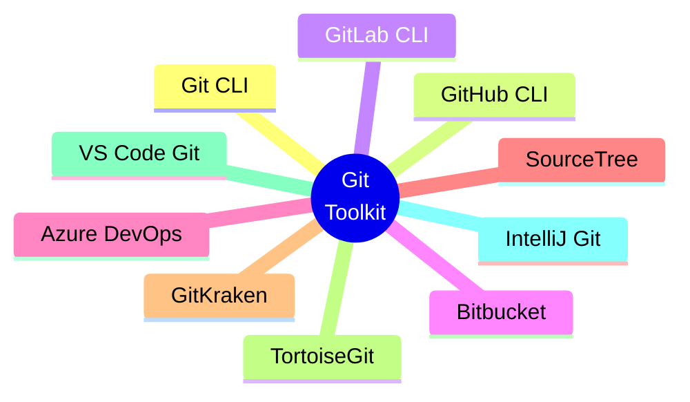

<div align="center">
    <p align="center">
        <a href="https://wikipedia.org/wiki/Git">
          
        </a>
    </p>


    
# [Git](https://git-scm.com/) Toolkit

</div>

[]()
[]()
[]()
[](https://www.reddit.com/r/git/new/)

<p align="center">
    <a href="https://github.com/cybersecurity-dev/"></a>
    &nbsp;
    <a href="https://www.youtube.com/@CyberThreatDefense"></a>
    &nbsp;
    <a href="https://cyberthreatdefence.com/my_awesome_lists"></a>
    
</p>

## 📖 Contents
- [GitHub CLI Tools](#github-cli-tools)
- [GitLab CLI Tools](#gitlab-cli-tools)
- [My Awesome Lists](#my-awesome-lists)
- [Contributing](#contributing)
- [Contributors](#contributors)


```text
Git Toolkit
│
├── Repository Management
│   ├── git init
│   ├── git clone
│   ├── git remote
│   └── git archive
│
├── File Tracking
│   ├── git add
│   ├── git rm
│   ├── git mv
│   └── git status
│
├── Commit Management
│   ├── git commit
│   ├── git amend
│   ├── git log
│   ├── git show
│   └── git reflog
│
├── Branching
│   ├── git branch
│   ├── git switch
│   ├── git checkout
│   ├── git merge
│   └── git rebase
│
├── Collaboration
│   ├── git fetch
│   ├── git pull
│   ├── git push
│   └── git remote
│
├── Comparison & Analysis
│   ├── git diff
│   ├── git blame
│   ├── git bisect
│   └── git shortlog
│
├── Stashing
│   ├── git stash
│   ├── git stash list
│   ├── git stash apply
│   └── git stash pop
│
├── Recovery
│   ├── git restore
│   ├── git reset
│   ├── git revert
│   └── git reflog
│
├── Tags & Releases
│   ├── git tag
│   └── git describe
│
└── Advanced Administration
    ├── git gc
    ├── git fsck
    ├── git filter-repo
    ├── git worktree
    └── git submodule
```


## [GitHub](https://wikipedia.org/wiki/GitHub) CLI Tools
-

## [GitLab](https://wikipedia.org/wiki/GitLab) CLI Tools
- [GitLab CLI tool](https://gitlab.com/gitlab-org/cli)


## Useful **`Git`** Commands

* Clone a specific Git branch
    ```shell
    git clone -b <branch> <remote_repo>
    ```

    ```bash
    git clone -b mybranch2 git@github.com:user/mygitproject.git
    ```
* Create New Branch
    ```bash
    git checkout -b <new-branch-name>
    ```
* Change Branch
    ```shell
    git checkout <branch name>
    ```
##

### My Awesome Lists
You can access the my awesome lists [here](https://cyberthreatdefence.com/my_awesome_lists)

### Contributing
[Contributions of any kind welcome, just follow the guidelines](contributing.md)!

### Contributors
[Thanks goes to these contributors](https://github.com/cybersecurity-dev/Git-Toolkit/graphs/contributors)!

[🔼 Back to top](#git-toolkit)
